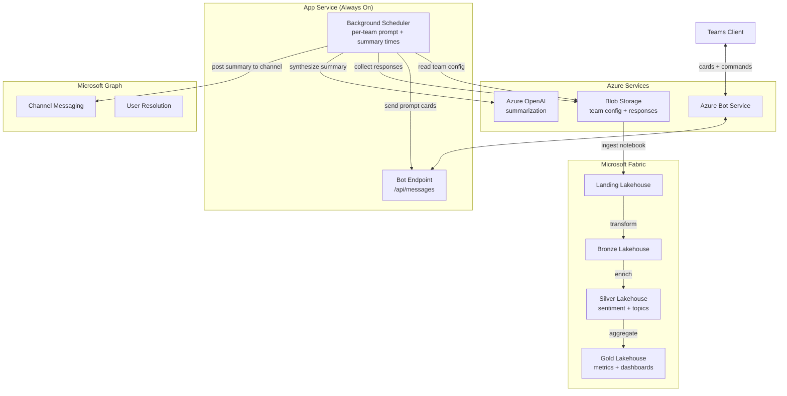

# Standup Agent

Multi-team async daily standup bot for Microsoft Teams. Prompts team members via Adaptive Cards, synthesizes AI-powered summaries with Azure OpenAI, posts to configured channels, and feeds standup history into a Microsoft Fabric analytics pipeline for blocker trend analysis and team health scoring.

## Architecture



## Core Flows

### Flow 1 -- Daily Standup Prompt

At each team's configured `prompt_time`, the background scheduler sends a personal Adaptive Card to every team member. The card collects:

- **Yesterday**: What was accomplished
- **Today**: What's planned
- **Blockers**: Any impediments
- **Skip (OOO)**: Mark as out-of-office

Responses are stored as individual JSON blobs: `standup-responses/{team}/{date}/{user}.json`

### Flow 2 -- Daily Team Summary

At each team's `summary_time`, the scheduler:

1. Collects all responses for the day
2. Sends them to Azure OpenAI for synthesis (themes, cross-dependencies, blockers, highlights)
3. Posts a summary Adaptive Card to the team's summary channel
4. Posts a status card showing who responded / skipped / didn't respond

### Flow 3 -- Weekly Rollup

On a configured day (e.g., Friday at 4 PM), the scheduler aggregates the week's standups per team and generates a rollup identifying recurring blockers, completed themes, velocity patterns, and team health signals.

### Flow 4 -- Bot Commands

| Command     | Description                            |
|-------------|----------------------------------------|
| `status`    | Show who has responded today           |
| `standup`   | Manually trigger your standup prompt   |
| `skip`      | Mark yourself as OOO for today         |
| `history`   | Show your last 5 standups              |

### Flow 5 -- Fabric Analytics Pipeline

| Notebook             | Stage   | Description                                              |
|----------------------|---------|----------------------------------------------------------|
| `01_ingest_main`     | Landing | Read raw JSON blobs into Landing lakehouse               |
| `02_transform_main`  | Bronze  | Normalize schema, cast types, deduplicate                |
| `03_enrich_main`     | Silver  | Sentiment analysis, topic extraction, blocker duration   |
| `04_aggregate_main`  | Gold    | Response rates, blocker analysis, health score, activity |

**Gold Tables:**

- `team_response_rates` -- daily/weekly response rates by team
- `blocker_analysis` -- frequency, duration, category breakdown
- `team_health_score` -- composite metric (response rate, blocker rate, update quality)
- `member_activity` -- individual contribution patterns over time

## Project Structure

```
STANDUP-AGENT/
  deploy/
    deploy.config.toml              # Infrastructure configuration
    deploy-infra.ps1                # Idempotent: RG, Storage, App Service, OpenAI, Bot, Entra, RBAC
    deploy-app.ps1                  # ZIP-deploy, seed blob, build manifest
    deploy-fabric.ps1               # Fabric lakehouses + notebooks
    assets/
      teams/
        teams_config.json.example   # Multi-team runtime config template
      notebooks/
        modules/                    # Shared Fabric notebook modules
        main/                       # Fabric pipeline notebooks (01-04)
  src/
    app.py                          # aiohttp entry point + scheduler startup
    bot.py                          # ActivityHandler: commands + card actions
    config.py                       # Settings from environment variables
    graph/                          # MSAL auth, channel messaging, user resolution
    services/                       # Team config, standup collection, summarization
    cards/                          # Adaptive Card builders (prompt, summary, status, weekly)
    background/                     # APScheduler with per-team timezone-aware cron jobs
    state/                          # Conversation reference storage, user-to-team mapping
  manifest/                         # Teams app manifest + icons
  requirements.txt
```

## Configuration

### Infrastructure (`deploy/deploy.config.toml`)

All Azure resource names, SKUs, and Fabric workspace references. Leave name fields empty to auto-derive from `naming.prefix`.

### Teams (`deploy/assets/teams/teams_config.json`)

Runtime configuration for each team -- seeded to blob by `deploy-app.ps1`:

```json
[
  {
    "name": "Engineering",
    "team_id": "<teams-team-id>",
    "summary_channel_id": "<channel-id>",
    "prompt_time": "09:00",
    "summary_time": "10:00",
    "weekly_rollup_day": "Friday",
    "weekly_rollup_time": "16:00",
    "timezone": "America/New_York",
    "members": [
      { "upn": "jane.doe@contoso.com", "display_name": "Jane Doe" }
    ]
  }
]
```

## Deployment

### Prerequisites

- Azure CLI (`az`) authenticated
- Python 3.11+
- PowerShell 7+

### Steps

```powershell
# 1. Edit configuration
notepad deploy/deploy.config.toml
copy deploy/assets/teams/teams_config.json.example deploy/assets/teams/teams_config.json
notepad deploy/assets/teams/teams_config.json

# 2. Deploy infrastructure
.\deploy\deploy-infra.ps1

# 3. Deploy application + seed config
.\deploy\deploy-app.ps1

# 4. Deploy Fabric pipeline (optional)
.\deploy\deploy-fabric.ps1

# 5. Upload teams-manifest.zip via Teams Admin Center
```

### Graph API Permissions (Application)

| Permission                                         | Purpose                          |
|----------------------------------------------------|----------------------------------|
| `User.Read.All`                                    | Resolve user IDs from UPNs      |
| `TeamsAppInstallation.ReadWriteSelfForUser.All`    | Proactively install bot          |
| `ChannelMessage.Send`                              | Post summaries to team channels  |

Grant these in the Azure Portal under **Entra ID > App registrations > API permissions**.

## Blob Storage Layout

```
standup-responses/
  {team_name}/
    {YYYY-MM-DD}/
      {user_upn}.json       # Individual response
      _summary.json          # Generated team summary
      _status.json           # Response tracking
    weekly/
      {YYYY-Www}.json        # Weekly rollup data

bot-config/
  teams_config.json          # Multi-team config (seeded by deploy)
```
